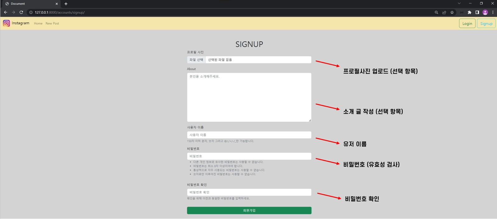
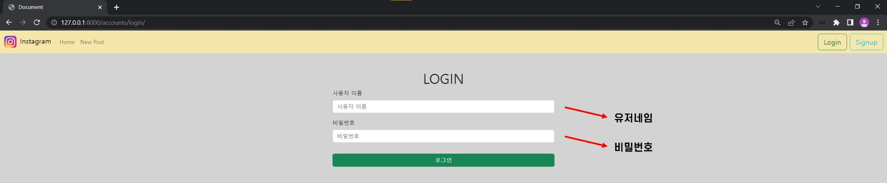
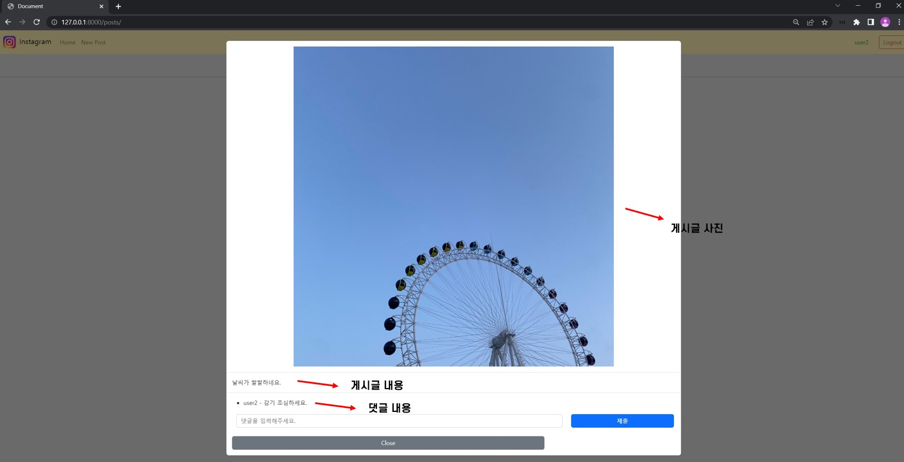

## 💡소개
* Instagram 클론코딩 프로젝트
* 기능
    * 회원가입
    * 로그인
    * 회원정보 CRUD
    * 포스트 CRUD
    * 댓글 CRUD
    * 좋아요
    * 팔로우

## 🛠️ 기술
* DJANGO 3.2
* BootStrap 5.0
* SQLite

## 🗄️ ERD

## 📺 작동화면
 

회원가입  

 

로그인  

 

메인화면  

 

프로필  

 

게시글 상세페이지    

 